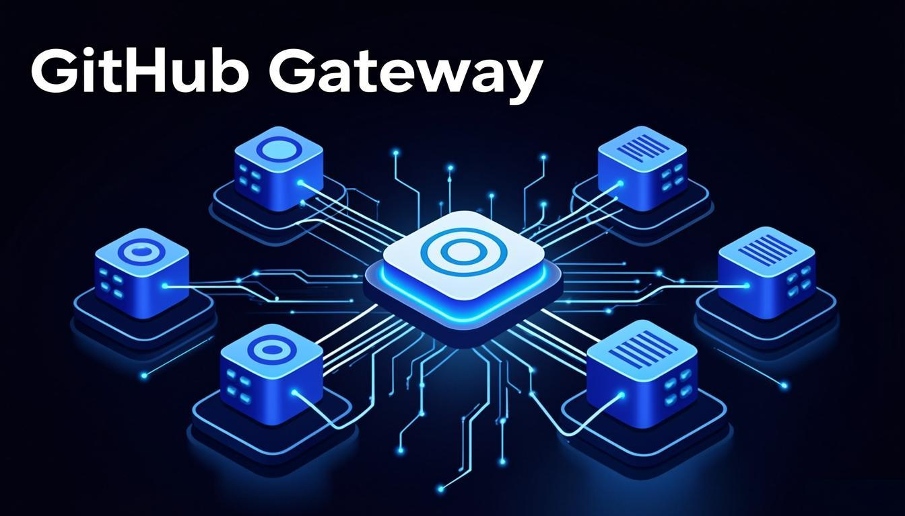
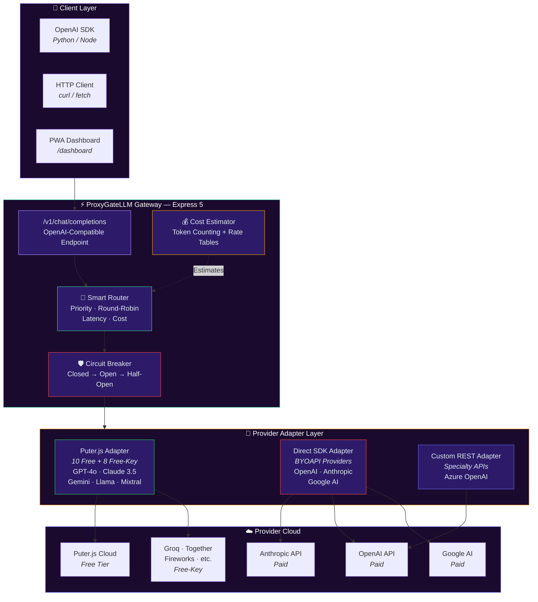
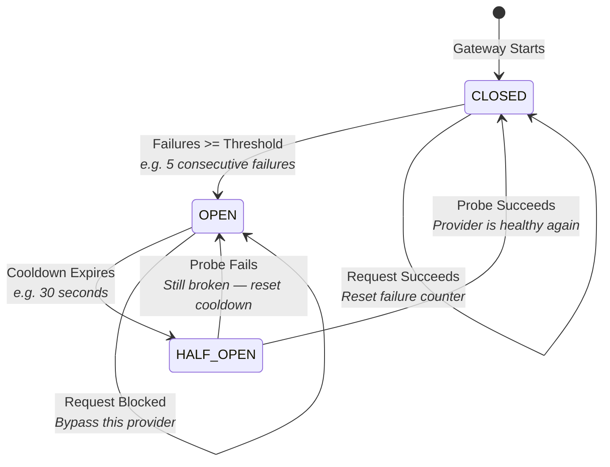
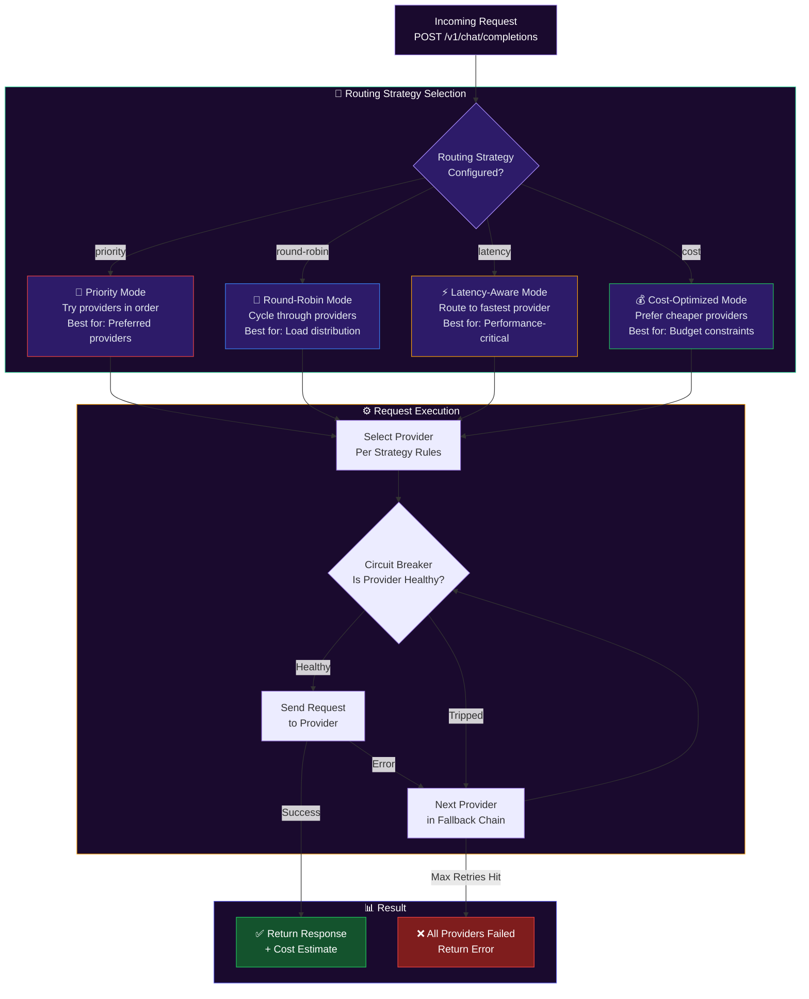
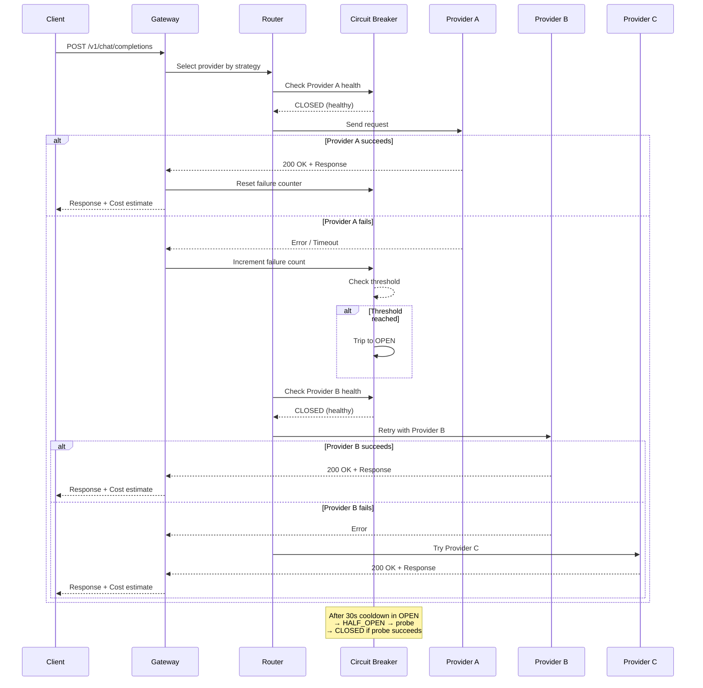

<a href="https://github.com/mulkymalikuldhrs/ProxyGateLLM">
  
</a>

<div align="center">

[](https://git.io/typing-svg)

<br/>

[](https://nodejs.org/)
[](https://expressjs.com/)
[](https://puter.com/)
[](https://www.anthropic.com/)
[](https://github.com/mulkymalikuldhrs/ProxyGateLLM/releases)
[](LICENSE)

<br/>

[](https://www.npmjs.com/package/proxygatelymm)
[](https://www.npmjs.com/package/proxygatelymm)
[](https://github.com/mulkymalikuldhrs/ProxyGateLLM/stargazers)
[](https://github.com/mulkymalikuldhrs/ProxyGateLLM/fork)
[](https://github.com/mulkymalikuldhrs/ProxyGateLLM/issues)
[](LICENSE)

</div>

---

## Overview

ProxyGateLLM is a self-hosted, open-source multi-LLM gateway that aggregates **22 AI providers** into a single unified API. It is designed to maximize free access to language models — 10 providers work without any API key at all, and an additional 8 require only a free signup. With only 4 runtime dependencies, ProxyGateLLM is lightweight, fast to install, and easy to deploy.

The gateway provides an **OpenAI-compatible API endpoint**, making it a drop-in replacement for any application that uses the OpenAI SDK. It includes circuit breaker protection, smart routing with round-robin failover, cost estimation, and a built-in PWA dashboard for monitoring.

> **Transparency Note**: "Free" providers use **Puter.js client-side authentication** (user-pays model). The 10 no-key providers work without user API keys, but usage is subject to Puter.js rate limits and fair use policies. BYOAPI providers require your own paid API keys. This is **not** an unlimited free service — it's a gateway that makes free-tier access convenient.

---

## 22 Providers

| # | Provider | Category | Key Required | Notes |
|---|----------|----------|:------------:|-------|
| 1 | OpenAI GPT-4o-mini | 🟢 FREE no-key | ❌ | Via Puter.js |
| 2 | OpenAI GPT-4o | 🟢 FREE no-key | ❌ | Via Puter.js |
| 3 | Claude 3.5 Sonnet | 🟢 FREE no-key | ❌ | Via Puter.js |
| 4 | Claude 3 Haiku | 🟢 FREE no-key | ❌ | Via Puter.js |
| 5 | Gemini 2.0 Flash | 🟢 FREE no-key | ❌ | Via Puter.js |
| 6 | Gemini 1.5 Pro | 🟢 FREE no-key | ❌ | Via Puter.js |
| 7 | Llama 3.1 70B | 🟢 FREE no-key | ❌ | Via Puter.js |
| 8 | Llama 3.1 8B | 🟢 FREE no-key | ❌ | Via Puter.js |
| 9 | Mixtral 8x7B | 🟢 FREE no-key | ❌ | Via Puter.js |
| 10 | Command R+ | 🟢 FREE no-key | ❌ | Via Puter.js |
| 11 | Groq (Llama/Mixtral) | 🟡 FREE-key | ✅ Free signup | groq.com |
| 12 | Together AI | 🟡 FREE-key | ✅ Free signup | together.ai |
| 13 | Fireworks AI | 🟡 FREE-key | ✅ Free signup | fireworks.ai |
| 14 | Cerebras | 🟡 FREE-key | ✅ Free signup | cerebras.ai |
| 15 | SambaNova | 🟡 FREE-key | ✅ Free signup | sambanova.ai |
| 16 | Mistral AI | 🟡 FREE-key | ✅ Free signup | mistral.ai |
| 17 | Cohere | 🟡 FREE-key | ✅ Free signup | cohere.com |
| 18 | AI21 Labs | 🟡 FREE-key | ✅ Free signup | ai21.com |
| 19 | OpenAI (Direct) | 🔴 BYOAPI | ✅ Paid key | platform.openai.com |
| 20 | Anthropic (Direct) | 🔴 BYOAPI | ✅ Paid key | console.anthropic.com |
| 21 | Google AI (Direct) | 🔴 BYOAPI | ✅ Paid key | aistudio.google.com |
| 22 | Azure OpenAI | 🔴 BYOAPI | ✅ Paid key | azure.microsoft.com |

> **Legend**: 🟢 FREE no-key = Works immediately via Puter.js · 🟡 FREE-key = Requires free signup at provider · 🔴 BYOAPI = Bring Your Own (paid) API Key

---

## Features

### 🔌 Unified API Endpoint

A single OpenAI-compatible `/v1/chat/completions` endpoint that routes across all 22 providers. Just change the `baseURL` in your existing OpenAI SDK code — no other changes needed.

### 🛡️ Circuit Breaker

Automatic failure detection with configurable cooldown periods. When a provider fails repeatedly, the circuit breaker trips and routes traffic to healthy alternatives — preventing cascading failures and timeout waits.

### 🧠 Smart Routing

Round-robin failover, priority-based selection, and latency-aware routing. Configure which providers to prefer and the gateway automatically balances load while falling back on errors.

### 💰 Cost Estimation

Real-time approximate cost tracking per request with token counting and provider rate tables. Get visibility into spending across providers — note that estimates are approximate and may differ from actual billing.

### 📊 PWA Dashboard

Built-in Progressive Web App for monitoring provider health, request throughput, error rates, and cost metrics — all from a single interface accessible at `/dashboard`.

### 🪶 Minimal Dependencies

Only 4 runtime dependencies: `express`, `dotenv`, `@heyputer/puter.js`, and `@anthropic-ai/sdk`. Small attack surface, fast installs, easy auditing.

### 🔄 Provider Failover

If a provider returns an error, the gateway automatically retries with the next available provider in the same category — seamless resilience without client-side retry logic.

### 🐳 Docker Ready

One-command deployment with Docker and Docker Compose. Production-ready containerization with configurable environment variables.

---

## Honest Notes

> We believe in transparency. Here are important limitations and clarifications you should know before using ProxyGateLLM.

- **"Free" providers use Puter.js client-side billing** — users authenticate and pay through Puter.js, not via API keys. Puter.js manages the billing relationship, not this gateway.
- **Provider availability depends on third-party services** that may change, deprecate models, or impose rate limits at any time.
- **Free-tier providers have usage limits** — they are suitable for development, prototyping, and light workloads, but **not for high-volume production**.
- **Circuit breaker thresholds are configurable but require tuning** per deployment environment. Default settings may be too aggressive or too lenient for your traffic patterns.
- **Cost estimation is approximate** — actual costs depend on provider pricing changes, tokenization differences, and rounding. Do not rely on estimates for exact billing.
- **This is a gateway, not an LLM provider** — ProxyGateLLM routes requests to existing providers. It does not host or serve models itself.

---

## Visual Architecture

> Interactive Mermaid diagrams showing gateway internals, routing logic, and the full request lifecycle.

### 1. Gateway Architecture

Clients hit a single OpenAI-compatible endpoint, and the gateway routes through the appropriate provider adapter:



### 2. Circuit Breaker State Machine

Automatic failure detection with configurable cooldown — prevents cascading failures:



### 3. Smart Routing Decision Tree

Four routing strategies with automatic failover — choose based on your priorities:



### 4. Provider Ecosystem Map

All 22 providers categorized by access tier — from zero-config to BYOAPI:

```mermaid
flowchart TB
    subgraph FREE["🟢 FREE — No API Key Needed"]
        direction LR
        F1["GPT-4o-mini"]
        F2["GPT-4o"]
        F3["Claude 3.5 Sonnet"]
        F4["Claude 3 Haiku"]
        F5["Gemini 2.0 Flash"]
        F6["Gemini 1.5 Pro"]
        F7["Llama 3.1 70B"]
        F8["Llama 3.1 8B"]
        F9["Mixtral 8x7B"]
        F10["Command R+"]
    end

    subgraph FREEKEY["🟡 FREE-KEY — Free Signup Required"]
        direction LR
        K1["Groq<br/><i>Llama/Mixtral</i>"]
        K2["Together AI"]
        K3["Fireworks AI"]
        K4["Cerebras"]
        K5["SambaNova"]
        K6["Mistral AI"]
        K7["Cohere"]
        K8["AI21 Labs"]
    end

    subgraph BYOAPI["🔴 BYOAPI — Bring Your Own Paid Key"]
        direction LR
        B1["OpenAI<br/><i>Direct</i>"]
        B2["Anthropic<br/><i>Direct</i>"]
        B3["Google AI<br/><i>Direct</i>"]
        B4["Azure<br/><i>OpenAI</i>"]
    end

    FREE -->|Upgrade for<br/>higher limits| FREEKEY
    FREEKEY -->|Need production<br/>SLAs| BYOAPI

    style FREE fill:#14532d,stroke:#22c55e,color:#fff
    style FREEKEY fill:#78350f,stroke:#f59e0b,color:#fff
    style BYOAPI fill:#7f1d1d,stroke:#ef4444,color:#fff
    style F1 fill:#166534,stroke:#4ade80,color:#dcfce7
    style F2 fill:#166534,stroke:#4ade80,color:#dcfce7
    style F3 fill:#166534,stroke:#4ade80,color:#dcfce7
    style F4 fill:#166534,stroke:#4ade80,color:#dcfce7
    style F5 fill:#166534,stroke:#4ade80,color:#dcfce7
    style F6 fill:#166534,stroke:#4ade80,color:#dcfce7
    style F7 fill:#166534,stroke:#4ade80,color:#dcfce7
    style F8 fill:#166534,stroke:#4ade80,color:#dcfce7
    style F9 fill:#166534,stroke:#4ade80,color:#dcfce7
    style F10 fill:#166534,stroke:#4ade80,color:#dcfce7
    style K1 fill:#92400e,stroke:#fbbf24,color:#fef3c7
    style K2 fill:#92400e,stroke:#fbbf24,color:#fef3c7
    style K3 fill:#92400e,stroke:#fbbf24,color:#fef3c7
    style K4 fill:#92400e,stroke:#fbbf24,color:#fef3c7
    style K5 fill:#92400e,stroke:#fbbf24,color:#fef3c7
    style K6 fill:#92400e,stroke:#fbbf24,color:#fef3c7
    style K7 fill:#92400e,stroke:#fbbf24,color:#fef3c7
    style K8 fill:#92400e,stroke:#fbbf24,color:#fef3c7
    style B1 fill:#991b1b,stroke:#f87171,color:#fecaca
    style B2 fill:#991b1b,stroke:#f87171,color:#fecaca
    style B3 fill:#991b1b,stroke:#f87171,color:#fecaca
    style B4 fill:#991b1b,stroke:#f87171,color:#fecaca
```



### 5. Request Flow — Full Lifecycle

From client request to response, including retries and circuit breaker interactions:



---

## Architecture

```
┌─────────────────────────────────────────────────────────────────┐
│                        Client Application                        │
│                   (OpenAI SDK / HTTP / Dashboard)                │
└──────────────────────────┬──────────────────────────────────────┘
                           │  POST /v1/chat/completions
                           ▼
┌─────────────────────────────────────────────────────────────────┐
│                      ProxyGateLLM Gateway                        │
│  ┌─────────────┐  ┌──────────────┐  ┌───────────────────────┐  │
│  │   Router     │  │   Circuit    │  │    Cost Estimator     │  │
│  │  (Priority/  │──│   Breaker    │  │  (Token Counting +    │  │
│  │   Round-     │  │  (Failure    │  │   Rate Tables)        │  │
│  │   Robin)     │  │  Detection)  │  │                       │  │
│  └──────┬───────┘  └──────┬───────┘  └───────────────────────┘  │
│         │                 │                                      │
│  ┌──────▼─────────────────▼──────────────────────────────────┐   │
│  │                    Provider Adapter Layer                   │   │
│  │  ┌──────────┐  ┌──────────┐  ┌──────────┐               │   │
│  │  │ Puter.js │  │ Direct   │  │  Custom  │               │   │
│  │  │ Adapter  │  │ SDK      │  │  REST    │               │   │
│  │  │ (10+8)   │  │ Adapter  │  │  Adapter │               │   │
│  │  └────┬─────┘  └────┬─────┘  └────┬─────┘               │   │
│  └───────┼──────────────┼─────────────┼──────────────────────┘   │
└──────────┼──────────────┼─────────────┼──────────────────────────┘
           │              │             │
     ┌─────▼─────┐  ┌────▼─────┐  ┌───▼──────┐
     │  Puter.js  │  │ Anthropic│  │  OpenAI  │
     │  Cloud     │  │   API    │  │   API    │
     │ (Free+Key) │  │ (BYOAPI) │  │ (BYOAPI) │
     └────────────┘  └──────────┘  └──────────┘
```

---

## Circuit Breaker

The circuit breaker protects your application from cascading failures when a provider goes down or becomes unresponsive.

### How It Works

```
         ┌──────────┐    Failure threshold    ┌──────────┐
    ────►│  CLOSED  │─────────────────────────►│   OPEN   │
         │ (normal) │                          │ (tripped)│
         └────┬─────┘                          └────┬─────┘
              │                                     │
              │  Success                    Cooldown │
              │  (reset failure                 expires│
              │   counter)                          │
              │                                     ▼
              │                              ┌──────────┐
              └──────────────────────────────│HALF-OPEN │
                                             │ (probing)│
                                             └──────────┘
```

| State | Behavior |
|-------|----------|
| **CLOSED** | Normal operation. Requests flow to the provider. Failures are counted. |
| **OPEN** | Provider is tripped. All requests bypass this provider. Cooldown timer starts. |
| **HALF-OPEN** | Cooldown expired. A single probe request is sent. If it succeeds → CLOSED. If it fails → OPEN again. |

### Configuration

```env
# .env

<!-- AUTO-PACKAGE-BADGES:START -->
<!-- Auto-generated package badges -->

   [](https://www.npmjs.com/package/proxygatelymm)

<!-- AUTO-PACKAGE-BADGES:END -->
CIRCUIT_BREAKER_FAILURE_THRESHOLD=5    # Failures before tripping
CIRCUIT_BREAKER_COOLDOWN_MS=30000      # Cooldown duration (30s)
CIRCUIT_BREAKER_HALF_OPEN_PROBES=1     # Probe requests in half-open state
```

> **Note**: These defaults are a starting point. High-traffic deployments may need shorter cooldowns and higher thresholds. Low-traffic deployments may need longer cooldowns to avoid premature re-probing. **Tune per deployment.**

---

## Cost Estimation

ProxyGateLLM provides approximate cost tracking for every request. Understanding how it works helps you interpret the numbers correctly.

### How Costs Are Calculated

```
Estimated Cost = (prompt_tokens × input_rate) + (completion_tokens × output_rate)
```

Rates are stored per-provider in a configurable rate table. For example:

| Provider | Input Rate (per 1M tokens) | Output Rate (per 1M tokens) |
|----------|:--------------------------:|:---------------------------:|
| GPT-4o-mini | ~$0.15 | ~$0.60 |
| Claude 3.5 Sonnet | ~$3.00 | ~$15.00 |
| Gemini 1.5 Pro | ~$1.25 | ~$5.00 |
| Llama 3.1 70B (free) | $0.00 | $0.00 |

### Important Caveats

- **Estimates are approximate** — provider pricing changes frequently and may not be immediately updated in the rate table
- **Tokenization varies** — different providers may count tokens differently, leading to cost discrepancies
- **Free-tier providers show $0.00** — but Puter.js may still bill on its end; this gateway only tracks what it can measure
- **Rounding errors accumulate** — for precise billing, always refer to your provider's dashboard

### Accessing Cost Data

Cost data is available via the `/v1/usage` endpoint and displayed in the PWA dashboard.

---

## Smart Routing

ProxyGateLLM routes requests intelligently across providers to maximize availability and minimize latency.

### Routing Strategies

| Strategy | Description | Best For |
|----------|-------------|----------|
| **Priority** | Tries providers in configured order, falling back on failure | When you prefer specific providers |
| **Round-Robin** | Cycles through available providers evenly | Distributing load across free providers |
| **Latency-Aware** | Routes to the provider with the lowest recent latency | Performance-critical applications |
| **Cost-Optimized** | Prefers cheaper providers when multiple can serve the model | Budget-conscious workloads |

### Configuration Example

```env
# .env
ROUTING_STRATEGY=priority          # priority | round-robin | latency | cost
PROVIDER_PRIORITY=gpt-4o-mini,claude-3.5-sonnet,gemini-2.0-flash
FAILOVER_ENABLED=true              # Auto-retry on next provider
MAX_RETRIES=3                      # Max retry attempts per request
```

### Failover Flow

```
Request ──► Provider A ──► Error ──► Provider B ──► Error ──► Provider C ──► Success
                                    (circuit breaker      (circuit breaker
                                     skips tripped)        allows probe)
```

When a request fails, the router immediately tries the next healthy provider in the priority chain. The circuit breaker ensures tripped providers are skipped, avoiding wasted time on known-failing endpoints.

---

## Quick Start

### Prerequisites

- **Node.js** >= 18
- **npm** >= 9

### Installation

```bash
# 1. Clone the repository
git clone https://github.com/mulkymalikuldhrs/ProxyGateLLM.git
cd ProxyGateLLM

# 2. Install dependencies
npm install

# 3. Configure environment
cp .env.example .env
# Edit .env — add BYOAPI keys if you have them (optional)

# 4. Start the gateway
npm start
```

### Verify

```bash
# Gateway should be running at http://localhost:3333
curl http://localhost:3333/v1/models
```

### Test a Chat Completion

```bash
curl -X POST http://localhost:3333/v1/chat/completions \
  -H "Content-Type: application/json" \
  -d '{
    "model": "gpt-4o-mini",
    "messages": [{"role": "user", "content": "Hello, ProxyGateLLM!"}]
  }'
```

### Use with OpenAI SDK (Python)

```python
from openai import OpenAI

client = OpenAI(
    base_url="http://localhost:3333/v1",
    api_key="not-needed"  # Free providers don't require a key
)

response = client.chat.completions.create(
    model="gpt-4o-mini",
    messages=[{"role": "user", "content": "Hello from ProxyGateLLM!"}]
)
print(response.choices[0].message.content)
```

---

## API Reference

### Endpoints

| Method | Endpoint | Description |
|--------|----------|-------------|
| `GET` | `/v1/models` | List all available models and their provider status |
| `POST` | `/v1/chat/completions` | OpenAI-compatible chat completion endpoint |
| `POST` | `/v1/chat/completions` (stream) | Streaming chat completion (`"stream": true`) |
| `GET` | `/v1/usage` | Get approximate cost and usage statistics |
| `GET` | `/health` | Gateway health check and provider status |
| `GET` | `/dashboard` | PWA monitoring dashboard |

### Chat Completion Request

```json
{
  "model": "gpt-4o-mini",
  "messages": [
    {"role": "system", "content": "You are a helpful assistant."},
    {"role": "user", "content": "Explain circuit breakers."}
  ],
  "temperature": 0.7,
  "max_tokens": 1024,
  "stream": false
}
```

### Response Format

Follows the standard OpenAI chat completion response format — fully compatible with the OpenAI SDK and any tooling built on top of it.

---

## Dashboard

ProxyGateLLM includes a built-in **Progressive Web App (PWA)** dashboard accessible at `/dashboard`.

### Features

- **Provider Health** — Real-time status of all 22 providers (healthy / tripped / probing)
- **Request Metrics** — Throughput, latency percentiles, error rates
- **Cost Tracking** — Approximate spend per provider, per model, per time window
- **Circuit Breaker Controls** — View and manually reset tripped circuits
- **Dark Mode** — Comfortable monitoring in any environment

### Access

```
http://localhost:3333/dashboard
```

The dashboard is a PWA — you can install it on your device for quick access without opening a browser tab.

---

## Docker

### Using Docker Compose (Recommended)

```bash
# Clone and configure
git clone https://github.com/mulkymalikuldhrs/ProxyGateLLM.git
cd ProxyGateLLM
cp .env.example .env
# Edit .env with your configuration

# Start with Docker Compose
docker compose up -d
```

### Using Docker Directly

```bash
# Build the image
docker build -t proxygate-llm .

# Run the container
docker run -d \
  --name proxygate-llm \
  -p 3333:3333 \
  -e NODE_ENV=production \
  --env-file .env \
  proxygate-llm
```

### Docker Compose File

```yaml
version: '3.8'
services:
  proxygate-llm:
    build: .
    ports:
      - "3333:3333"
    env_file:
      - .env
    restart: unless-stopped
    healthcheck:
      test: ["CMD", "curl", "-f", "http://localhost:3333/health"]
      interval: 30s
      timeout: 10s
      retries: 3
```

---

## Attribution

ProxyGateLLM was inspired by [OmniRoute](https://github.com/nicepkg/omniroute) — an open-source AI gateway project. While ProxyGateLLM was built from scratch with its own architecture and feature set, the concept of a unified multi-provider API gateway owes credit to projects like OmniRoute that pioneered the space.

---

## Related Projects

We're building a family of open source tools! Check out our other projects:

| Project | Description | Stars |
|---------|-------------|-------|
| [📈 Quant-Nanggroe-AI](https://github.com/mulkymalikuldhrs/Quant-Nanggroe-AI) | AI-powered quantitative analysis for Nanggroe market | ⭐ |
| [🧠 AI-MultiColony-Ecosystem](https://github.com/mulkymalikuldhrs/AI-MultiColony-Ecosystem) | Multi-agent AI colony simulation | ⭐ 3 |
| [📋 Kalen](https://github.com/mulkymalikuldhrs/kalen) | Smart scheduling and AI task management | ⭐ |
| [🤖 ProxyGateLLM](https://github.com/mulkymalikuldhrs/ProxyGateLLM) | Multi-LLM gateway with priority fallback | ⭐ 36 |
| [🧩 Mnemosyne](https://github.com/mulkymalikuldhrs/mnemosyne) | Knowledge management and note-taking | ⭐ |

🚀 **[Visit our Contributor Hub](https://mulkymalikuldhrs.github.io/contribute-to-our-projects/)** — 28 open source projects seeking contributors!

---

## Disclaimer

**For Education and Research Purpose Only**

This project is provided strictly for educational and research purposes. The authors and contributors assume **no responsibility or liability** for any damages, losses, or risks arising from the use of this software.

- **We do not guarantee provider availability** — third-party services may change, rate-limit, or discontinue free tiers at any time.
- **We do not bear any responsibility for costs** incurred through Puter.js or BYOAPI providers — monitor your usage carefully.
- **We do not endorse or guarantee** the quality, safety, or accuracy of responses from any provider.
- Use at your own risk. Always review provider terms of service before integrating.

---

## License

This project is licensed under the **MIT License** — see the [LICENSE](LICENSE) file for details.

Copyright © 2024-2026 Mulky Malikul Dhaher. All rights reserved.

---

## Author

**Mulky Malikul Dhaher**

[](https://github.com/mulkymalikuldhrs)
[](mailto:mulkymalikudhr@mail.com)

---

<a href="https://github.com/mulkymalikuldhrs/ProxyGateLLM">
  
</a>

<!-- Schema.org Structured Data for Search Engines -->
<script type="application/ld+json">
{
  "@context": "https://schema.org",
  "@type": "SoftwareSourceCode",
  "name": "ProxyGateLLM",
  "author": {
    "@type": "Person",
    "name": "Mulky Malikul Adhr",
    "url": "https://github.com/mulkymalikuldhrs"
  },
  "programmingLanguage": "TypeScript",
  "license": "https://spdx.org/licenses/MIT",
  "codeRepository": "https://github.com/mulkymalikuldhrs/ProxyGateLLM",
  "contributor": {
    "@type": "Organization",
    "name": "Open Source Contributors",
    "url": "https://mulkymalikuldhrs.github.io/contribute-to-our-projects/"
  }
}
</script>
